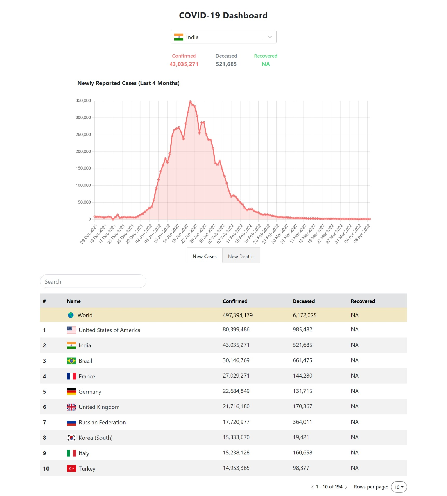
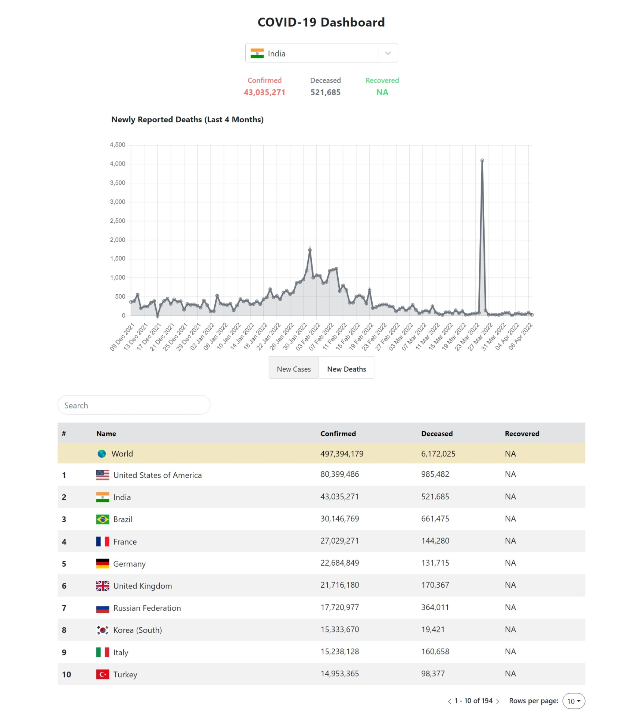

## Opslyft Frontend Assignment

- This repo contains the source code for the task that was given as part of Opslyft's frontend-intern assignment.

- A COVID-19 Tracker/Dashboard app had to be built that shows the latest covid-19 virus cases around the world.

- The UI has a table of all countries with their respective covid stats and a chart tracking the rise in cases and deaths in the last four months. You can also see an overview of these stats at the top.

### Screenshots

  

 

